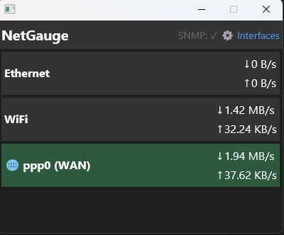

# NetGauge

A network bandwidth monitoring tool with a declarative UI experiment for [GPUI](https://gpui.rs).



## Overview

NetGauge is a Rust project that monitors network interface bandwidth in real-time. It consists of two main components:

1. **`netgauge` library/CLI** - Cross-platform network statistics collection
2. **`netgauge-gui`** - A GPUI-based GUI application featuring an experimental declarative UI layer

This project serves as an **experimentation ground for declarative UI patterns** on top of GPUI.rs, exploring JSX-like and Tailwind-inspired syntax for building user interfaces.

---

## Declarative UI for GPUI

The `netgauge-gui` crate includes an experimental declarative UI layer (`declarative_ui.rs`) that provides:

### Features

- **JSX-like macro syntax** - Write UI with familiar HTML-like tags
- **Tailwind-inspired styling** - Use utility classes like `flex`, `gap-4`, `bg-dark`
- **Virtual list support** - Efficient `uniform_list` rendering for large datasets
- **Event handling** - `onclick` handlers with state management

### Syntax Examples

#### JSX-style Macro

```rust
let ui = jsx! {
    <div class={"flex col bg-dark size-full"}> {
        <div class={"flex row items-center p-4 bg-gray text-white bold"}> {
            <text>{"Hello World"}</text>
        } </div>
        <list id={"my-list"} count={items.len()} class={"flex-grow"} render={item_renderer} />
    } </div>
};
```

#### Alternative `ui!` Macro

```rust
let ui = ui! {
    div["flex col bg-dark size-full"] {
        div["flex row items-center p-4 bg-gray"] {
            text["Hello World"]
        }
    }
};
```

### Supported Style Classes

| Class | Description |
|-------|-------------|
| `flex`, `row`, `col` | Flexbox layout |
| `flex-grow` | Flex grow |
| `items-center`, `justify-center`, `justify-between` | Alignment |
| `gap-{n}`, `p-{n}` | Spacing (gap, padding) |
| `w-{n}`, `h-{n}`, `size-{n}`, `size-full` | Dimensions |
| `bg-dark`, `bg-gray`, `bg-blue`, `bg-wan` | Background colors |
| `text-white`, `text-gray`, `text-dim` | Text colors |
| `text-sm`, `text-lg`, `text-xl`, `text-2xl` | Text sizes |
| `bold`, `cursor-pointer` | Font weight, cursor |

### Virtual Lists

The `<list>` element renders as GPUI's `uniform_list` for efficient scrolling:

```rust
let renderer = |ix: usize| {
    jsx! {
        <div class={"p-2 bg-gray text-white"}> {
            <text>{format!("Item {}", ix)}</text>
        } </div>
    }
};

jsx! {
    <list id={"items"} count={100} class={"flex-grow"} render={renderer} />
}
```

---

## NetGauge Library & CLI

The `netgauge` library provides cross-platform network statistics collection.

### Supported Platforms

- **Windows** - Uses `GetIfTable2` API
- **macOS** - Uses `getifaddrs` with `if_data`
- **Linux** - Parses `/proc/net/dev`

### Library Usage

```rust
use netgauge::{fetch_net_stats, list_interfaces, DeltaTracker, InterfaceSet};

// List available interfaces
let interfaces = list_interfaces();

// Select interfaces to monitor
let selected: InterfaceSet = ["eth0", "wlan0"].iter().map(|s| s.to_string()).collect();

// Fetch stats and track deltas
let mut tracker = DeltaTracker::new();
let stats = fetch_net_stats(&selected);
let deltas = tracker.update(&stats);

for d in deltas {
    println!("{}: RX {} TX {}", d.interface, d.rx_delta, d.tx_delta);
}
```

### SNMP WAN Monitoring

NetGauge can monitor router WAN interfaces via SNMP:

```rust
use netgauge::{is_snmp_available, detect_interface_index, fetch_wan_stats};

let target = "192.168.1.1:161";
let community = b"public";

if is_snmp_available(target, community) {
    // Auto-detect ppp0 interface
    if let Some((index, name)) = detect_interface_index(target, community, "ppp") {
        let stats = fetch_wan_stats(target, community, index, &name);
        println!("WAN RX: {} TX: {}", stats.rx_bytes, stats.tx_bytes);
    }
}
```

### CLI Usage

```bash
# Real-time bandwidth monitor
cargo run

# Discover SNMP interfaces on your router
cargo run --bin snmp_discover

# Build release binary
cargo build --release

# Run release binary directly
./target/release/netgauge
```

---

## Building

```bash
# Build everything
cargo build

# Run the GUI
cd netgauge-gui
cargo run

# Run the CLI
cargo run
```

## License

MIT

